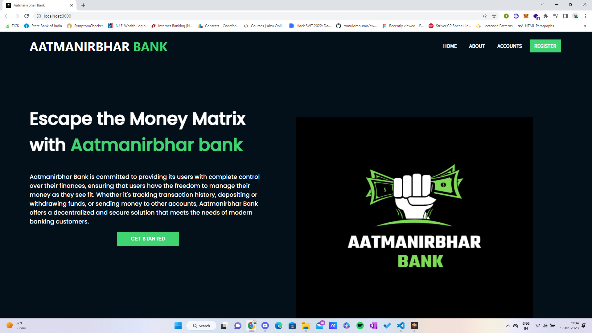
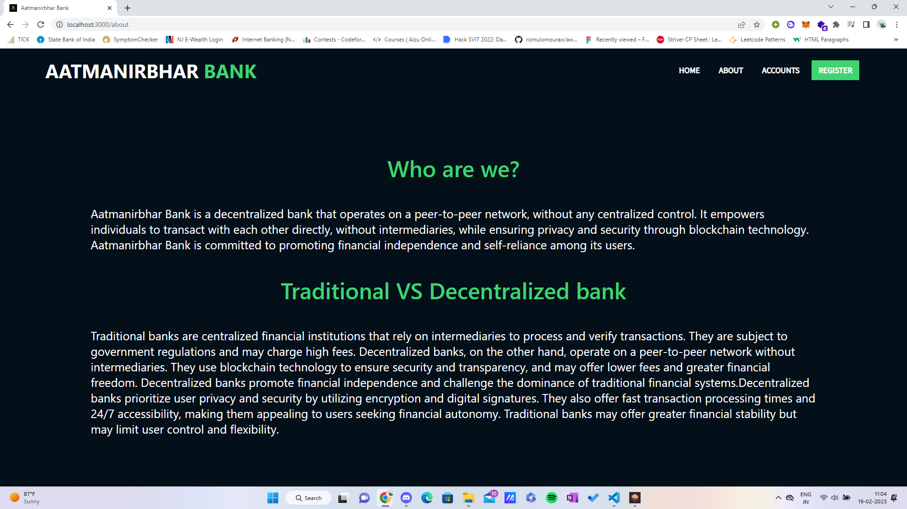
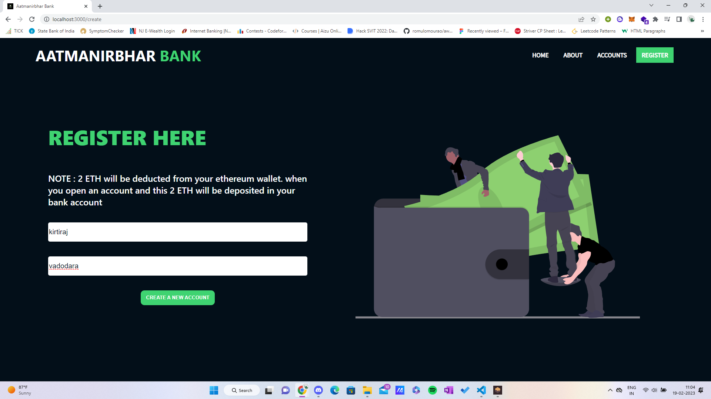
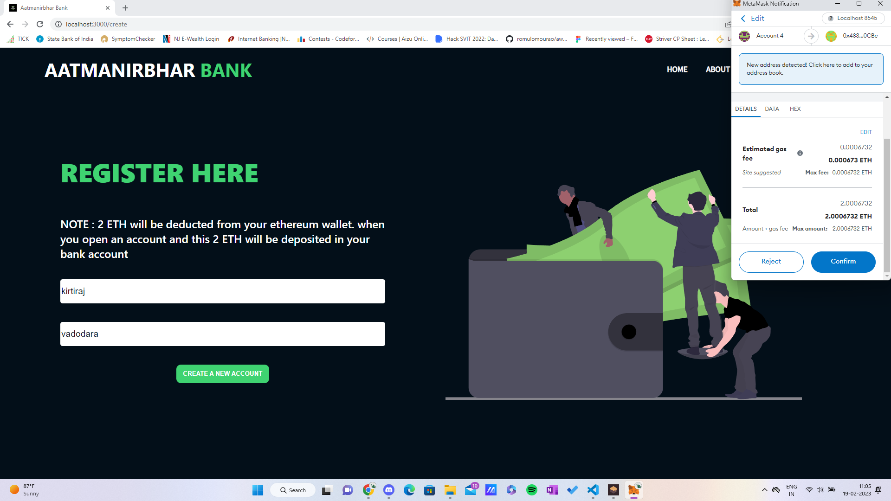
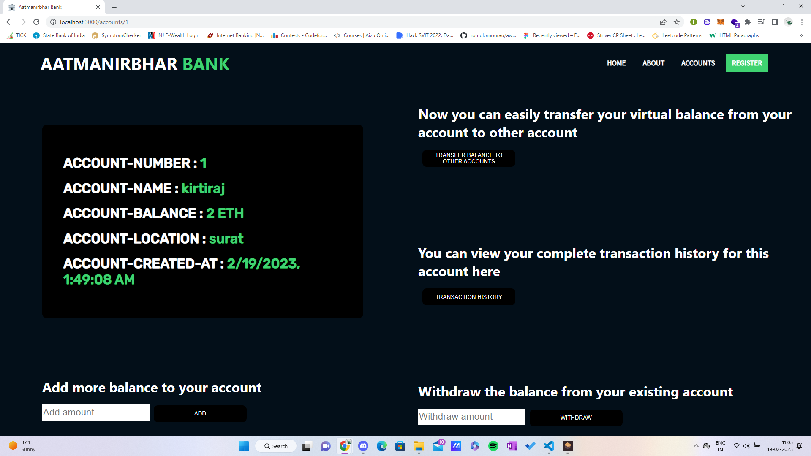

# Aatmanirbhar Bank - A decentralized bank system

Aatmanirbhar Bank is a decentralized bank that operates on a blockchain-based platform. It allows users to manage their finances through a decentralized network without the need for traditional banking institutions. The bank offers a range of financial services, including depositing and withdrawing funds, transferring money to other accounts, and viewing transaction history.
The bank operates on a peer-to-peer network, allowing users to transact directly with one another without the need for intermediaries such as banks. This decentralization ensures that users have complete control over their funds and can transact in a secure and transparent manner.
## Features

- Create Bank Account : Users can create a bank account. Users are suppossed to deposit 2 ETH in their account. 
- Deposit or Withdraw ethers to/from the virtual bank.
- Transfer money from one account to another account.
- Show account details 
- display transaction history of the user.


## Traditional Banks VS Aatmanirbhar Bank :

- Decentralized platform: Aatmanirbhar Bank operates on a decentralized platform, allowing users to transact directly with each other without the need for intermediaries. This eliminates the need for traditional banks, reducing fees and increasing accessibility.

- Transparency: The blockchain technology used by Aatmanirbhar Bank ensures that transactions are transparent, allowing users to view their transaction history and monitor their funds. This increases trust and reduces the potential for fraudulent activity.

- Secure transactions: Transactions on the Aatmanirbhar Bank platform are secure and tamper-proof, using blockchain technology to ensure that transactions cannot be altered. This provides a secure alternative to traditional banking methods.

- Control over funds: Aatmanirbhar Bank gives users complete control over their funds, empowering them to manage their finances without the need for traditional banking institutions.


## Run Locally

Clone the project

```bash
  git clone https://github.com/kirtiraj22/Aatmanirbhar-Bank-DotSlash-.git
```

Compile solidity using (make sure that your ganache is running in background):

```bash
  truffle migrate --reset
```

Go to the client directory

```bash
  cd client
```
```bash
  npm run start
```

Install dependencies

```bash
  npm install
```


## Tech Stack

- React JS
- Web3 JS
- Solidity

## Dependencies Required 
- react-router-dom
```
    npm i react-router-dom
```

- web3 JS
```
    npm install web3
```

= Truffle 
```
    npm install -g truffle
```

## screenshots
home page of website : 



about section of website : 



Registration page 


Filling up details of registration page 


payment through metamask


showing registered accounts 


Details of account 



